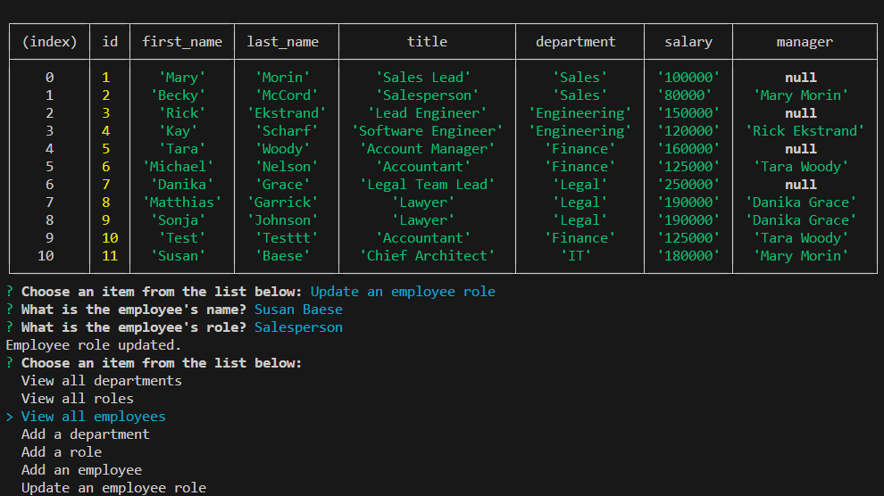

# SQL Employee Tracker

## Description/What I attempted to do

Create a command-line application that displays and alters employee information stored in databases based on user input. The application is run by entering the comman "node index.js" into the terminal. I built this application as a way to store and modify work data. As part of this project, I learned how to use MySQL to generate and manage a database.

## Table of Contents

### [Usage](#usage)

### [License](#license)

### [Contributing](#contributing)

### [Questions](#questions)

## Usage

Open the terminal in sql-employee-tracker and enter "node index.js" into the terminal. Select a choice from the options presented and answer questions as they appear on screen. Results will be displayed in table format above the questions. This project uses MySQL, Node.js and Inquirer.

## License

The license for this project is MIT and the link for license information is https://opensource.org/licenses/MIT.

## Contributing/Acknowledgements

Tips from University of Minnesota Full Stack Bootcamp instructor Gary Almes and notes from class sessions.

Tips from tutoring session with Alexis San Javier through University of Minnesota coding boot camp.

Information on Inquirer questions located here: https://www.npmjs.com/package/inquirer#prompt-types

## Questions

Please find more information at my GitHub, located [here](https://github.com/Jacqueline-Stiehl).
If you have additional questions, please contact me at salsajackie@yahoo.com.

## Screen shot

## Link to the working version of the code

https://github.com/Jacqueline-Stiehl/sql-employee-tracker-jstiehl

## Link to walkthrough video

https://watch.screencastify.com/v/geO9IJsDVBDcvCbN4xRj
